# GrantHound



**Live inbox:** https://d39zkv96tau3is.cloudfront.net · **Video:** (added at submission) · **Track:** Good Neighbor Agents, AWS Agents for Humans

## What is the problem?

Small nonprofits find grants by refreshing funder pages. The best free grant
database in America is a desktop at the county library, one day a month, in
person. Paid databases start at $299 a month, more than a month of program
budget for an organization running on $185,000 a year. AI search tools hand
back expired links and grants that do not exist. The costliest failure is not
a rejected proposal; it is the week spent on a funder whose cycle closed last
year and whose page still says "Applications open".

## Why does it matter?

88% of US nonprofits spend under $500K a year. Very small nonprofits are 60%
of organizations and received 0.4% of foundation funding 2019 to 2023. For
them a missed deadline is a missed year.

## Who is it for?

Maya, executive director of a $185K community youth organization in
Columbus, Ohio, with two part-time staff and no development director.
Grant-seeking is her fourth job. She does not want a draft. She wants:
"these three are real, open, and you qualify. Start with this one."

## How does it work?

A background agent watches a curated list of funder pages, verifies each
program is **actually live**, scores fit against the org's profile, tracks
deadlines and rule changes, and surfaces only apply-or-pass decisions, every
verdict carrying a dated page-snapshot receipt.

**GrantHound never writes your proposal.** It decides what is worth your
time, and proves why.

One cycle runs four Strands agents in a row over each funder page:

| Agent | Model | Does |
|---|---|---|
| Scout | Claude Haiku 4.5 | fetches the page, stores a hashed snapshot (the receipt everything else is checked against) |
| Verifier | Claude Haiku 4.5 | decides whether the program is live, in the funder's own words |
| Analyst | Claude Sonnet 4.6 | scores fit on five weighted axes with a hard eligibility gate |
| Clerk | Claude Haiku 4.5 | collects the dates and requirements for programs worth a human's time |

**The boundary rule** makes the verdicts checkable: every quote an agent
stores must appear word for word in the stored snapshot, and every date must
be one the page printed (a month-only date keeps its day marked as invented
and counts to month end). The recording tools enforce this in code, not in
the prompt. A quote that is not on the page is dropped, the program is
flagged, and it goes to a human instead of being acted on. Any verdict can be
re-derived from the snapshot it cites, by you, later, without trusting the
model that produced it.

### Measured, not asserted

The table covers runs from 2026-09-06, the cutoff for the full seed list.
Ten earlier runs remain in the store: three failed attempts against a
larger Claude model, three on Amazon Nova during model selection, and
four on the current models over the three original seeds. This is the
output of a fresh `scripts/stats.py --since 2026-09-06` against the
committed export, not a copy kept up by hand — running it again after the
next scheduled cycle will print different, newer numbers in this same
shape (drop `--since` to see the full 26-run history).

| Measure | Value |
|---|---|
| Runs from: 2026-09-06 (16 of 26 runs in the store) |  |
| Programs watched | 20 |
| Latest run | run-20260906T234110Z at 2026-09-06T23:41:10.603342+00:00 (ok) |
| Runs on record | 16 |
| Verdicts | APPLY 1 · NEEDS_HUMAN 12 · PASS 7 |
| Verified live | 5 |
| Verified dead (closed, final call, prior year, no program found) | 8 |
| Suspect (stale date, year trap, contradiction) | 6 |
| Unreachable | 1 |
| Not yet checked | 0 |
| Distinct quotes stored (each verbatim-checked against its snapshot) | 65 |
| Programs where a quote had to be dropped | 7 |
| Tokens by node (model) | analyst 289,066 (global.anthropic.claude-sonnet-4-6 289,066) · clerk 104,938 (global.anthropic.claude-haiku-4-5-20251001-v1:0 104,938) · scout 87,913 (global.anthropic.claude-haiku-4-5-20251001-v1:0 87,913) · verifier 912,548 (global.anthropic.claude-haiku-4-5-20251001-v1:0 912,548) |

Verdict stability so far: 20 programs with two evals; 3 verdict flip(s)
between the two latest cycles (2026-09-06 11:38Z and 23:38Z); 2 of 20
flipped between the pair before. None of the five was a change in what the page says. Four
are the boundary rule catching a model output that failed a deterministic
check that cycle: the fixture went to NEEDS_HUMAN at 11:38Z because the
Clerk's structured output failed to parse (flag `clerk_missing`) and back
to APPLY at 23:38Z; NEA Big Read (WATCH -> NEEDS_HUMAN) and Save The Music
(PASS -> NEEDS_HUMAN) had a quote from the Analyst, Clerk, or Verifier
that was not found verbatim in that cycle's snapshot. The fifth is real:
`lowes-hometowns`, a stale no-year deadline flagged NEEDS_HUMAN, resolved
on the next pass to a confirmed dead program (PASS). So the same page can
get a different verdict on a different day, and in every flip observed so
far the move was toward NEEDS_HUMAN when a model slipped and back when it
did not. Treat any single-cycle APPLY or PASS as one cycle's reading.

The EventBridge schedule has fired three times: at creation over the
three original seeds (`run-20260905T233923Z`), and twice over all 20
(`run-20260906T113853Z`.. and `run-20260906T233853Z`..; four chunks
each). The 08:01Z full cycle was started by hand. The proof of an
unattended fire is the AWS/Scheduler `InvocationAttemptCount` metric, not
the store. See `docs/measured.md` for the raw per-program lines this
table and these paragraphs are pasted from. Stability compares each
program's two latest evaluations across all runs in the store, not only
the runs in the table above.
Every number above regenerates with `scripts/stats.py`; nothing is typed by
hand.

## AWS services and the Strands Agents SDK

- **Strands Agents SDK** (`GraphBuilder`): the four agents are graph nodes with one conditional edge (Verifier to Analyst fires only when something is live). Each node has one read tool and one record tool; the record tool validates in code and rejects bad values back to the model.
- **Amazon Bedrock AgentCore Runtime**: the graph is deployed as a CodeZip runtime (`agent/`). One invocation runs one cycle inside an AgentCore async task, so the runtime stays healthy-busy until the last chunk is finalized. AgentCore Observability traces show the four nodes and every tool call.
- **Amazon Bedrock**: Claude Haiku 4.5 and Claude Sonnet 4.6 via global inference profiles, `temperature=0`, explicit `max_tokens`, adaptive retries.
- **EventBridge Scheduler + Lambda**: a 12-hour schedule fires a 30-line Lambda that calls `InvokeAgentRuntime`.
- **DynamoDB + S3**: one append-only EVAL row per program per run; raw and normalized snapshots and diffs in a private bucket.
- **S3 + CloudFront**: the static inbox, regenerated from the store by `scripts/export_inbox.py`.
- **SSM Parameter Store**: holds the Telegram bot token as a SecureString; the runtime posts a cycle summary and never fails a cycle over it.

## Run it yourself

Prerequisites: Python 3.12+, Node 20+, an AWS account with Bedrock access to Claude Haiku 4.5 and Claude Sonnet 4.6 in us-east-1, the AWS CLI logged in, `npm i -g @aws/agentcore`.

```bash
git clone https://github.com/damli40/granthound && cd granthound
python3 -m venv .venv && .venv/bin/pip install -r requirements-dev.txt
.venv/bin/python -m pytest -q                      # no AWS needed; nothing here touches the network

# Store (DynamoDB + S3), once:
python3 -m venv infra/.venv && infra/.venv/bin/pip install -r infra/requirements.txt
(cd infra && PATH="$PWD/.venv/bin:$PATH" npx cdk deploy GranthoundStore --outputs-file outputs.json)
# put the two names from infra/outputs.json into .env as GRANTHOUND_TABLE / GRANTHOUND_BUCKET and into agent/runtime.env

.venv/bin/python scripts/seed_load.py              # META rows from agent/granthound/seeds/maya.yml
.venv/bin/python scripts/run_local.py --all        # one full cycle, locally, against real Bedrock
.venv/bin/python scripts/export_inbox.py && (cd web && python3 -m http.server 8765)   # the inbox at http://localhost:8765

# Deploy the runtime + schedule + inbox (optional):
agentcore deploy -y                                # prints the runtime ARN; save it to infra/runtime-arn.txt
# Always run scripts/export_inbox.py right before this: GranthoundWeb uploads
# web/data.json and web/deadlines.ics exactly as they sit on disk, it does not
# regenerate them itself, so a deploy after a stale export just republishes
# stale data.
(cd infra && PATH="$PWD/.venv/bin:$PATH" npx cdk deploy GranthoundSchedule -c runtimeArn="$(cat runtime-arn.txt)" GranthoundWeb)
```

`scripts/run_local.py --no-llm --program-id ID` runs only the deterministic fetch-and-scan half, with no model calls and no cost.

## Getting started as an org (onboarding today)

Edit `agent/granthound/seeds/maya.yml`: the `org` block is your profile and commitment windows, the `seeds` list is the funder pages you want watched. Run `scripts/seed_load.py`. The next scheduled cycle picks them up. Deadlines land in `deadlines.ics` on the inbox (add it to any calendar), and, with a Telegram bot configured (see `docs/telegram.md`), every cycle posts a one-line summary to your chat.

## Roadmap (not built)

- Onboarding by Telegram or a web form: describe your org in a chat, paste funder URLs, GrantHound writes the profile and seeds for you.
- Per-program Telegram alerts when a verdict changes (today: one summary per cycle).
- Diff receipts witnessed by the Internet Archive, so the proof does not rest on our own bucket.

## Known limits (disclosed)

- The web inbox is a static export; it refreshes when `export_inbox.py` runs, not live.
- Corporate and state-agency sites that block plain fetches, or that render their content only in a browser (client-side JavaScript), cannot be watched in this version — the seed filter rejects any candidate whose plain-fetch HTML comes back too short or with no dates in it. No state-agency page survived that filter; every seed in the current list is a community foundation, a corporate-giving page, a national funder, or the disclosed test fixture.
- A page whose future deadline-looking dates (any date found within 120 characters of a word like "deadline", "due", or "closes") span more than 30 days is treated as self-contradictory and sent to a human rather than acted on. Real funder pages that lay out a multi-stage timeline (an "opens", an "early deadline", and a "final deadline" months apart, say) trip this on purpose — it is conservative by design. No program in the current table is held for this reason; the test fixture hit it once before its wording was fixed.
- Verdicts are not guaranteed stable run to run. The stability line above is measured from all 20 programs, which now have two evaluations on record; 3 of the 20 flipped between the two latest cycles, and every one of those flips was the boundary rule catching a model output that failed a deterministic check that cycle, not a change in what the funder's page says. What holds by construction, not by this small sample: a quote that fails the verbatim check, a date the scanner never found, or the self-contradictory-timeline case above all route to NEEDS REVIEW rather than an unearned APPLY or PASS.
- `changed_terms` is never emitted: there is no deterministic gate for it, and page-hash diffs false-positive on every nav tweak.
- Month-only deadlines compare against day 1 for commitment-window collisions (a collision late in the month can be missed).
- The Analyst was designed for a larger Claude model that is not enabled on this account, so every run in the table used Claude Sonnet 4.6.

## Provenance

The verification *methodology* (the year-check, a weighted fit rubric with a hard eligibility gate, the disposition taxonomy, headline-vs-reachable award decomposition) is ported from the author's own pre-existing grant-pipeline playbook: markdown process documents containing **zero code**. Every line of code in this repository was written during the hackathon submission period. Dependencies are listed in `agent/requirements.txt` and `requirements-dev.txt`.

One seed, `fixtures/sunset-fund`, is a **test funder page we control** (`is_fixture: true`, hosted at `https://d39zkv96tau3is.cloudfront.net/fixtures/sunset-fund/index.html`), so a page *change* can be demonstrated on camera; real funders do not edit their pages on a recording schedule. Every other seed is a real funder page, and the agent's verdicts about them are recomputable live.

## License

MIT. See `LICENSE`.
